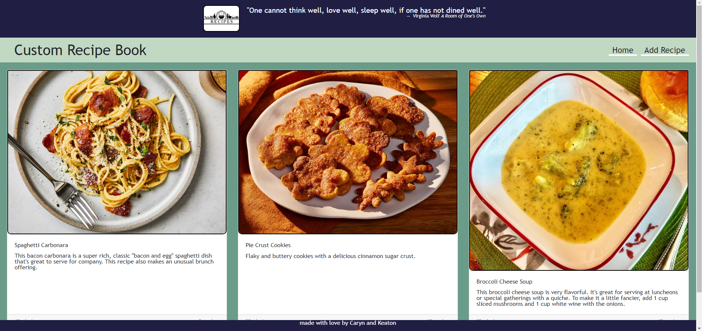
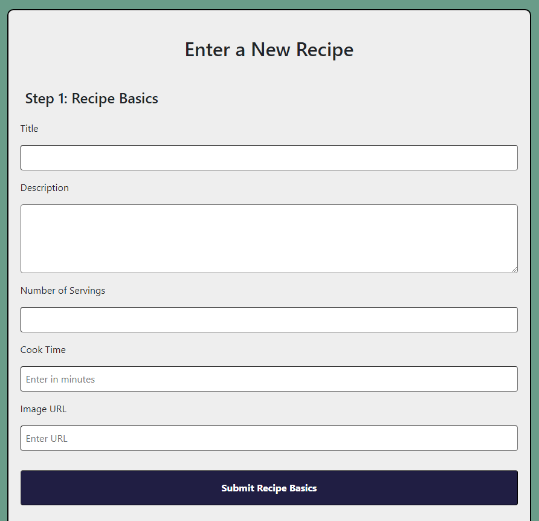
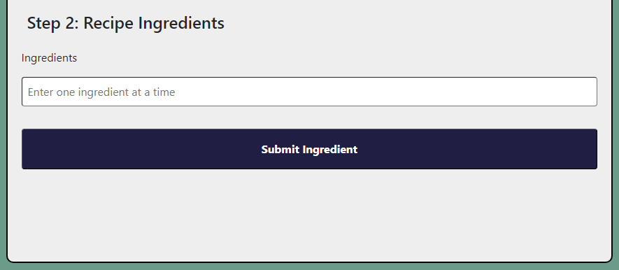
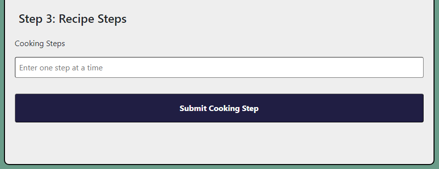
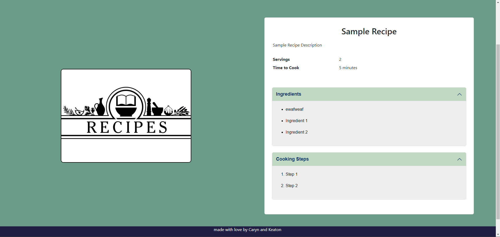
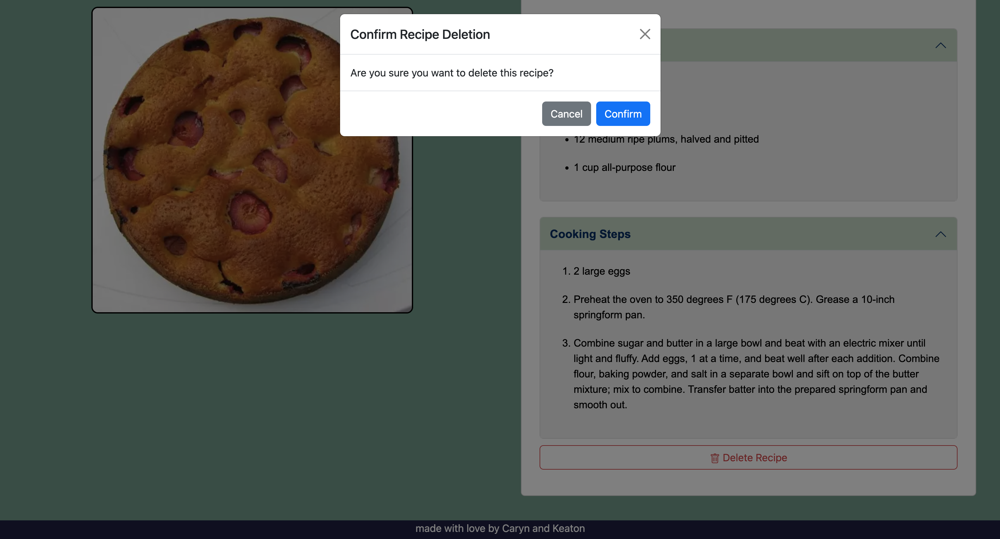
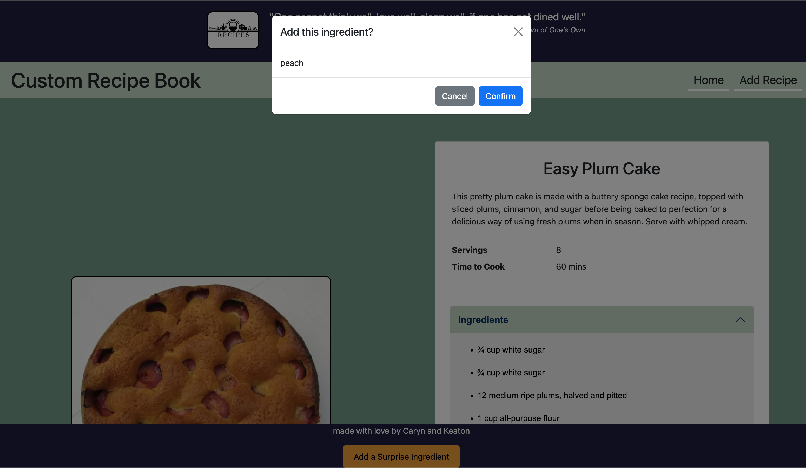

# Custom Recipe Book

This project was done in order to make it easy to save your own recipes to a personalized online recipe book. You are given three recipes to start, and you can add as many custom recipes as you want. These custom recipes will be added to the home screen and saved in your browser for future reference. After creating a recipe, you can click on it on the home page to view it, and from here delete the recipe or even add a random ingredient to shake things up. We hope you enjoy using our custom recipe book!

[Click here to try it out!](https://caryndcarter.github.io/recipe-book/index.html)

### Table of Contents
-[Video Demonstration](#video-demonstration)
-[How To View a Recipe](#how-to-view-a-recipe)
-[How to Add a New Recipe](#how-to-add-a-new-recipe)
-[How to Delete a Custom Recipe](#how-to-delete-a-custom-recipe)
-[Add a Random Surprise Ingredient](#add-a-random-surprise-ingredient-to-a-recipe)
-[Technologies Used in this Project](#technologies-used-in-this-project)

### Video Demonstration
TODO

## How To Use Our Custom Recipe Book

### How To View a Recipe
After opening the website using the link provided above, you will be presented with the home screen. This screen shows a card for each recipe that has been added to the site by you, in addition to three recipes we've provided to get you started.
If you want to find out how to make one of these recipes, simply click anywhere on the card and you will be shown the detailed instructions on how to make that recipe.

---

### How To Add a New Recipe
If you want to add your own recipe, find the navigation link in the top-right of the screen that says "Add Recipe" and click on it. You will be redirected to a form where you can fill out the details of the recipe you are adding.
1. First, you will be able to fill out basic information about the recipe. You can give your recipe a title and description, list how many servings the recipe makes, indicate how long the recipe takes to make, and even enter an image link to be associated with the recipe. To add a custom image, you will first have to upload your desired picture to Imgur or a similar image hosting website. After that, you will need to copy the image address of the image and paste that link into the form before submitting the recipe basics

2. After filling out the recipe basics, it's time to add all of the ingredients required to make the recipe. Enter the first ingredient and press the "Submit Ingredient" button, then repeat this process until you have added all the ingredients needed for the recipe.

3. After adding all the ingredients, you will now have to add the preparation and cooking steps one by one just like with the ingredients. Enter the first step then press the "Submit Cooking Step" button, then repeat the process until you are finished adding steps.

4. Once you have finished adding the cooking steps, you can press the "View Final Recipe" button on the left side of the screen to finalize your recipe, storing it on the website until you decide to clear 

---

### How to Delete a Custom Recipe
When viewing a custom recipe, you can delete the recipe by following these steps. Note: starter recipes cannot be deleted, only custom recipes added by the user can be deleted.
1. Go to the home screen by clicking the "Home" navigation button or by clicking the header text "Custom Recipe Book"
2. Click on the recipe you would like to delete
3. At the bottom of the recipe details, below the steps, there is a red outlined button with a trash can icon that says "Delete Recipe"
4. Click the "Delete Recipe" button and a confirmation modal will appear, asking if you really meant to delete the recipe
5. To confirm the deletion of the recipe, click confirm. The recipe will be deleted from the Custom Recipe Book and you will be redirected to the home screen.

---

### Add a Random Surprise Ingredient to a Recipe
When viewing any recipe, you can add a random surprise ingredient to that recipe by following these steps.
1. Locate the yellow button at the bottom of the page that says "Add a Surprise Ingredient"
2. Click the button. A modal will show up telling you the surprise ingredient that was randomly chosen, and you can either confirm the addition of the surprise ingredient or cancel the request.
3. If you click confirm, the surprise ingredient will be added to the list of ingredients for that recipe, and the page will update to reflect the addition of the new ingredient. If you click cancel, no changes will be made to the recipe.

### Technologies Used in This Project
- HTML
- CSS
- JavaScript
- Bootstrap
